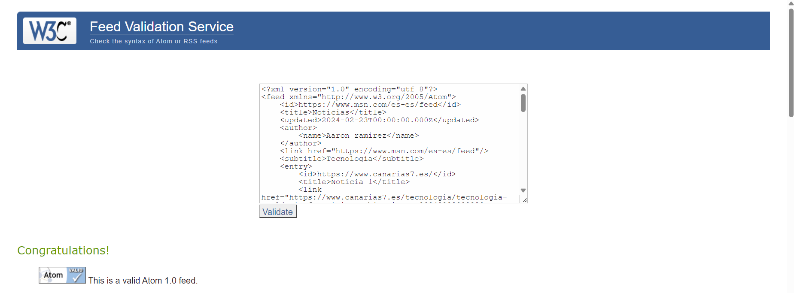

<!DOCTYPE html>
<html>
<head>
	<meta lang="es-ES">
	<link rel="stylesheet" href="index.css">
</head>
<body>

  

	  <b>PAGINA WEB DE NOTICIAS DE AARON</b>
	  

	  

	  Aqui esta mi pagina web alojado en github:  
	  <a href="https://Aaron02037.github.io">Github</a>
	  <a href="./index.xml">Pagina web</a>  
	    
  
  
  

	
Echo por Aaron Ramirez

  

</body>
</html>
